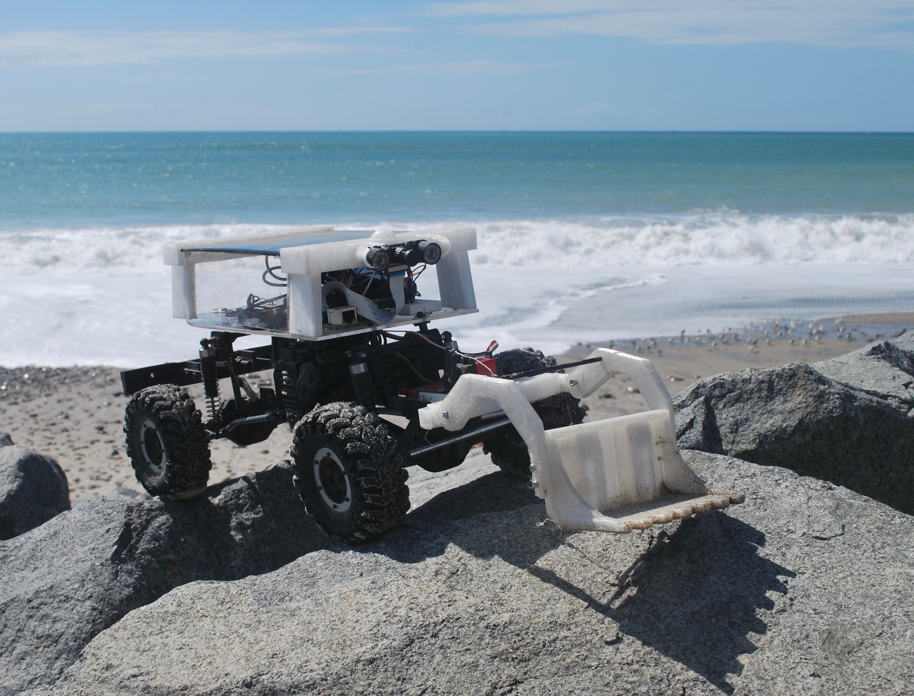

# LitterBug: Autonomous Trash Rover

[](https://travis-ci.org/wroscoe/donkey)
[](https://img.shields.io/pypi/pyversions/donkeycar.svg)

The LitterBug is a trash pick up rover built off the [Donkeycar](https://github.com/wroscoe/donkey) platform.  
Donkeycar is minimalist and modular self driving library for Python. It is
developed for hobbyists and students with a focus on allowing fast experimentation and easy
community contributions.

#### Quick Links
* [LitterBug Write-up](https://www.hackster.io/poopityscoop/litterbug-autonomous-trash-rover-765498)
* [LitterBug Build instructions and Software documentation](http://docs.litterbug.com)
* [Donkeycar Documentation](http://donkeycar.com)



#### Build a LitterBug to:
* Create a version of a real life WALL-E!
* Experiment with autopilots, mapping computer vision and neural networks.
* Train your rover to pick up trash anywhere (..and have fun while saving the planet)
* Log sensor data. (images, user inputs, sensor readings)

### Start Training!
After building a Litterbug, press the select button on the ps3 controller and get rolling.

### Create your own parts.
Since the LitterBug is built off the Donkeycar platform, you can use their structure to create new parts. 

```python
#Define a vehicle to take and record pictures 10 times per second.

from donkeycar import Vehicle
from donkeycar.parts.camera import PiCamera
from donkeycar.parts.datastore import Tub


V = Vehicle()

#add a camera part
cam = PiCamera()
V.add(cam, outputs=['image'], threaded=True)

#add tub part to record images
tub = Tub(path='~/mycar/get_started',
          inputs=['image'],
          types=['image_array'])
V.add(tub, inputs=['image'])

#start the drive loop at 10 Hz
V.start(rate_hz=10)
```

You can also control your new part by mapping an unused button in the controller.py file 
```python
#AVAILABLE BUTTONS = ['tr', 'tl2', 'tr2', 'mode', 'thumbl', 'thumbr']
#AVAILABLE AXES = ['y', 'z', 'rx']

#In the update() method of the JoystickController class add:

if button == '<AVAILABLE BUTTON HERE>' and button_state == 1:
    #do something!

```
See [LitterBug write-up](https://www.hackster.io/poopityscoop/litterbug-autonomous-trash-rover-765498), [donkeycar resources](http://donkeycar.com),
or join the [Donkeycar Slack channel](http://www.donkeycar.com/community.html) to learn more and share your build.
